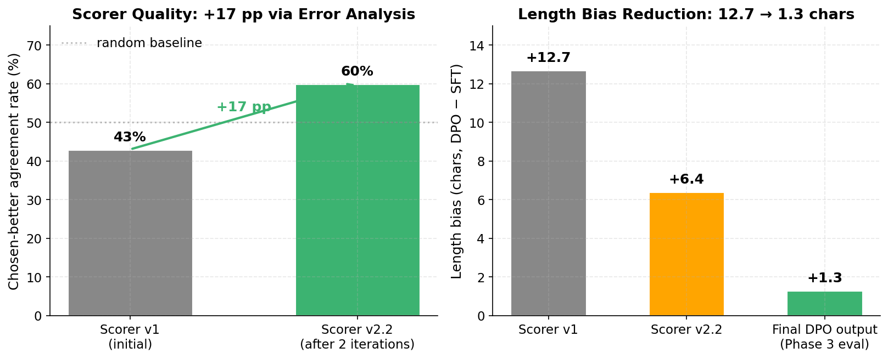
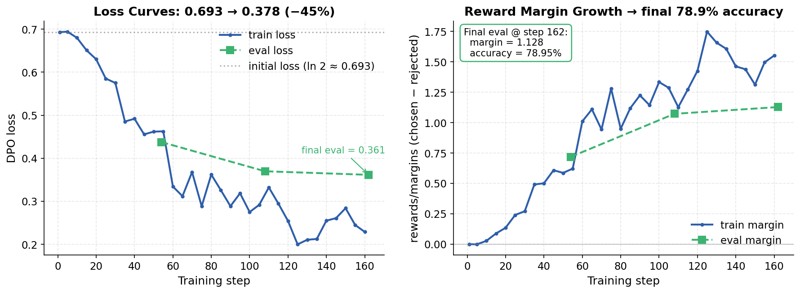
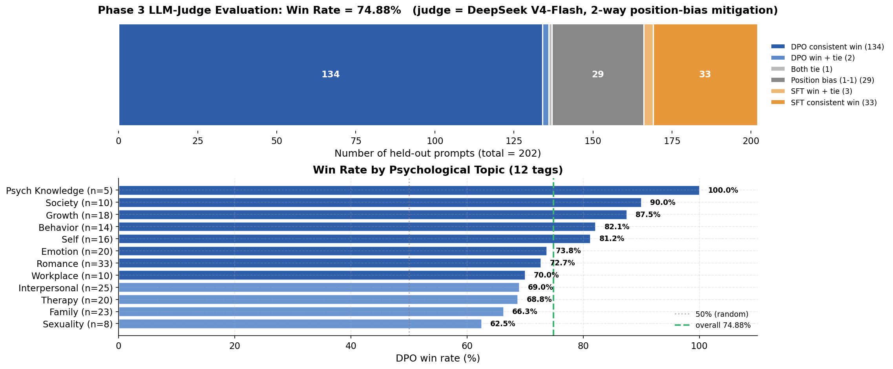

# Psy-Qwen-DPO: Aligning a Psychological Counselor LLM via DPO

[](https://modelscope.cn/models/linglcn/Psy-Qwen-DPO-LoRA)
[](LICENSE)
[](https://www.python.org)


> Iteratively align a Chinese-language psychological counselor LLM (Qwen3.5-0.8B) using **Direct Preference Optimization** on top of an existing SFT model. End-to-end pipeline: scorer-driven preference data curation → DPO LoRA training → LLM-as-Judge evaluation.

**Result:** **74.9% win rate** vs. SFT baseline on 202 held-out prompts, with **near-zero length bias** (+1.3 chars), evaluated using DeepSeek V4-Flash as judge with 2-way position-bias mitigation.

🔗 Companion repo (Stage 1, SFT): [Psy-Qwen-SFT](https://github.com/ChenLingD/Psy-Qwen-SFT)

---

## TL;DR

This project takes a Supervised-Fine-Tuned Chinese psychological counseling LLM and applies **DPO alignment** to make its replies more empathetic, more grounded in the client's actual words, and less prone to leading questions or premature advice.

The work is roughly evenly split across **three engineering challenges**:

1. **Building a trustworthy scorer.** Auto-generating preference pairs from a single SFT model is hard — naive scorers latch onto length, repetition, or surface form. I iteratively refined a 7-dimensional rule-based scorer through 2 rounds of error analysis on 60 manually-reviewed sample pairs, raising chosen-better agreement from **43% → 60%** and reducing length bias from **+12.7 → +6.4 chars** in the training pairs (and **+1.3 chars** in final DPO outputs).

2. **DPO training under environment constraints.** Single A10 (24 GiB), `ms-swift` framework, LoRA only (5.4M / 0.63% params). Discovered and patched a `trl 0.24.0` bug (truthy-tuple issue across 12 `is_X_available()` functions) that blocked training entirely. Final eval: **78.95% reward accuracy**, eval loss 0.36 (below train loss → no overfit), reward margin +1.13.

3. **Evaluation rigor.** Single-pass LLM-as-Judge has known **position bias**. I evaluated each pair twice with swapped A/B order using DeepSeek V4-Flash, then categorized outcomes (consistent win / win+tie / position-biased / SFT win) before computing weighted win rate.

---

## Headline Numbers

| Stage | Metric | Result |
|---|---|---|
| **Scorer iteration** | chosen-better agreement | 43% → **60%** (+17 pp) |
| **Scorer iteration** | length bias in train pairs | +12.7 → +6.4 chars |
| **DPO training** | eval reward accuracy | **78.95%** (15/19 val pairs) |
| **DPO training** | DPO loss (start → end) | 0.693 → 0.378 (−45%) |
| **DPO training** | trainable params | 5.4M / 0.63% (LoRA) |
| **Phase 3 eval** | overall win rate vs SFT | **74.88%** (202 prompts) |
| **Phase 3 eval** | DPO consistent wins | 134 / 202 (66.3%) |
| **Phase 3 eval** | length bias (DPO − SFT) | **+1.3 chars** |

---

## Pipeline Overview
```text
SFT model (Psy-Qwen-SFT, completed earlier)
|
v
Sample 1232 prompts from PsyDTCorpus held-out portion
|
v
Generate K=4 candidate replies per prompt with diverse temperatures
|
v
Score each reply with rule-based scorer v2.2 (7 dimensions)
^                                                       |
|                                                       v
+---- Iterate (2 rounds, error analysis on 60 pairs) ---+
|
v
Form 431 preference pairs (chosen vs rejected) + 19 val pairs
|
v
DPO training: LoRA r=8, beta=0.1, 3 epochs, lr=5e-6 (ms-swift)
|
v
Phase 3: 200-prompt LLM-as-Judge eval (DeepSeek V4-Flash, 2-way)
|
v
74.88% win rate
```

---

## Phase 1 — Preference Data Curation

**Challenge.** A naive auto-scorer can lock onto trivial patterns (the longer reply wins, the one with more "你" wins, etc.). With only 1232 prompts available and no human annotation budget, scorer quality is the bottleneck.

**Approach.** A 7-dimensional rule-based scorer:
- `empathy_lead`: presence of empathic openers
- `good_question`: open-ended counseling questions
- `cited_user_words`: mirroring the client's exact phrasing
- `length_penalty`: penalty against verbose drift
- `repetition_penalty`: penalty for redundant phrasing
- `closing_question`: encouraging follow-up
- `safety_floor`: guardrails

**Iteration.** I sampled 30 chosen/rejected pairs and manually labeled which one I'd actually prefer as a counseling client. Disagreement with the scorer surfaced systematic failures (e.g., chasing rare templates, overweighting length). Two iterations gave:



| | Scorer v1 | Scorer v2.2 |
|---|---|---|
| chosen-better agreement | 43% | **60%** |
| length bias (chars) | +12.7 | +6.4 |

**Final dataset.** 431 train + 19 val preference pairs, stratified across 12 psychological topics (romance, family, emotion, growth, …). 782 prompts kept fully held-out for Phase 3.

---

## Phase 2 — DPO Training

**Setup.**
- Base: `Qwen3.5-0.8B` (the SFT-fine-tuned counselor model)
- Framework: `ms-swift 4.1.0.dev0` (consistent with SFT stage)
- Adapter: LoRA `r=8, α=32`, target `qkv_proj + o_proj + mlp.{up,down,gate}`
- Reference adapter: same SFT adapter (standard DPO setup)
- Hyperparams: `β=0.1, lr=5e-6, 3 epochs, bf16, grad_ckpt`
- Hardware: 1 × NVIDIA A10 (24 GiB)

**Trainable parameters: 5.4M (0.63%) — peak GPU memory 9.66 / 24 GiB.**

**Bug fix unblocking training.** `trl 0.24.0` ships a quiet bug where `_X_available = _is_package_available("X")` returns a tuple `(bool, version)` instead of a `bool`. Twelve `is_X_available()` functions then become permanently truthy (non-empty tuple), breaking imports for `llm_blender`, `weave`, etc. when those packages aren't installed. Patched by adding `[0]` indexing to all 12 lines (see [`scripts/setup_env.sh`](scripts/setup_env.sh) for the reproducible patch). See [`DEBUG_LOG.md`](DEBUG_LOG.md) for full debugging notes covering this and 3 other issues (transformers/peft compatibility, ms-swift VLM target_modules, generation `eos_token_id` mismatch).

**Training curves:**



| Metric | Final value |
|---|---|
| `train_loss` (last log step) | 0.378 |
| `eval_loss` (epoch 3) | **0.361** ← *below train_loss → no overfit* |
| `eval_rewards/accuracies` | **78.95%** (15/19) |
| `eval_rewards/margins` | 1.128 |
| Train time | 40m 46s on A10 |

---

## Phase 3 — LLM-as-Judge Evaluation

**Why this matters.** "DPO loss decreased" and "reward accuracy = 79%" are training-set metrics — they don't tell us whether the model **actually generates better counseling replies on unseen prompts**. So we eval on 200 held-out prompts (none seen during DPO training), generate SFT and DPO replies under identical decoding settings, and have a strong external LLM compare them blind.

**Methodology.**

| Choice | Value | Why |
|---|---|---|
| Sample | 200 held-out prompts (actual: 202 due to rounding) | Stratified across 12 tags by their proportion in held-out pool |
| Generation | `T=0.7, top_p=0.9, rep_pen=1.05, fixed seed=42` | Variance comes only from LoRA, not sampling |
| Judge | DeepSeek V4-Flash | Recent strong CN-capable model, cheap (<¥1 for 404 calls) |
| Position bias mitigation | Each pair judged **twice** with swapped A/B order | `404 = 202 × 2` total API calls |
| Verdict | `{A wins, B wins, Tie}` + 1-line reason | `temperature=0` for determinism |

**Scoring rule.** For each prompt with two judgments:
- Both runs DPO-wins → 1.0
- Both runs SFT-wins → 0.0
- Both tie → 0.5
- One DPO + one SFT (position bias) → 0.5
- One win + one tie → 0.75 / 0.25 accordingly

**Results:**



| Outcome | Count | % |
|---|---|---|
| DPO consistent win (both runs) | **134** | **66.3%** |
| DPO win + tie | 2 | 1.0% |
| Both tie | 1 | 0.5% |
| Position bias (1-1 split) | 29 | 14.4% |
| SFT win + tie | 3 | 1.5% |
| SFT consistent win (both runs) | 33 | 16.3% |
| **Overall weighted win rate** | | **74.88%** |
| Pure win rate (DPO consistent / DPO+SFT consistent) | 134 / 167 | **80.2%** |

**Tag-level breakdown.** All 12 topics show ≥62.5% DPO win rate; no scenario where DPO regressed.

**Length bias check.** DPO mean length = 64 chars, SFT mean = 63 chars. The +1.3 char difference rules out length bias as the source of DPO's win — the gain comes from content quality.

---

## Case Studies

Selected from the 202 held-out prompts. Original Chinese prompts retained; tags translated for readability. **Full file:** [`outputs/case_studies.md`](outputs/case_studies.md)

### Case 1 — DPO captures the client's specific worry (Romance)

> **Client:** I'm worried about staying together for an uncertain future...

- **SFT:** *"This uncertainty makes you uneasy, which is natural. Would you like to explore some possible solutions together?"* — generic, jumps to advice-mode.
- **DPO:** *"It sounds like the uncertainty about the future is making you anxious. Would you share how you usually face this kind of uncertainty? Is there anything that helps you ease this feeling?"* — stays with the emotion, asks about coping.
- Both judge runs: **DPO wins**.

### Case 3 — DPO doesn't go off-topic (Emotion)

The client just admitted feeling out of control over their own emotions in arguments.

- **SFT:** *"Losing control and anger are common reactions. You also mentioned dissatisfaction with your sex life — would you share what makes you see that as a problem?"* — ⚠️ pivots away to a different (sensitive) topic the client didn't bring up in this turn.
- **DPO:** *"It sounds like you feel helpless and angry about losing control. In moments like this, how do you usually handle these emotions?"* — mirrors the exact emotion, opens a coping question.
- Both judge runs: **DPO wins**.

### Case 4 — Honest limitation: SFT wins (Emotion)

The client said *"I can't even protect myself"*. Here, the simpler SFT response (open-ended specification of "self-protection") was judged better than the DPO response, which **over-suggested** relaxation activities. DPO's advice-giving tendency, normally a weakness in SFT, occasionally tips too far in the opposite direction.

### Case 5 — Position bias on a borderline case (Growth)

A parent worrying about reducing their child's after-school classes. Both replies are reasonable; the judge picks the **second-presented** option both times — a clear demonstration of why 2-way mitigation matters. A single-pass evaluation here would have arbitrarily credited either model.

→ See [`outputs/case_studies.md`](outputs/case_studies.md) for full transcripts including all judge reasoning.

---

## Trained Model

The DPO LoRA adapter is publicly available on **ModelScope Hub**:

🔗 **[linglcn/Psy-Qwen-DPO-LoRA](https://modelscope.cn/models/linglcn/Psy-Qwen-DPO-LoRA)** — 21 MB adapter weights + model card + training history

```python
from modelscope import snapshot_download
adapter_path = snapshot_download("linglcn/Psy-Qwen-DPO-LoRA")
# Then load on top of your SFT base — see ModelScope page for full inference example.
```

---

## Reproduce

### 1. Environment

```bash
# After cloning + entering DSW / similar Linux env with CUDA + A10
bash scripts/setup_env.sh
# This installs peft 0.19.1, mergekit, and patches the trl 0.24.0 truthy-tuple bug.
```

### 2. Pipeline

```bash
# Phase 1 (already produced; run only to regenerate)
python scripts/extract_prompts.py        # 1232 prompts from PsyDTCorpus
python scripts/sample_responses.py       # K=4 candidates per prompt
python scripts/score_and_pair.py         # 7-dim scorer → preference pairs

# Phase 2: DPO training
bash scripts/train_dpo.sh                # ~40 min on A10, β=0.1, 3 epochs

# Phase 3: evaluation
python scripts/full_sanity_check.py      # 5-prompt human review (sanity)
python scripts/phase3_generate.py        # 202 × (SFT + DPO) generations
python scripts/phase3_judge.py           # 404 DeepSeek API calls (~10 min)
python scripts/phase3_summary.py         # win rate + breakdown
python scripts/extract_cases.py          # 5 case studies for README

# Phase 4: figures
python scripts/make_figures.py           # 3 PNGs in outputs/figures/
```

### 3. API key

```bash
export DEEPSEEK_API_KEY="sk-..."   # for phase3_judge.py
```

---

## Limitations & Honest Caveats

- **In-distribution evaluation.** All eval prompts come from the same PsyDTCorpus distribution as training. The 74.9% win rate doesn't directly tell us how the model would perform on prompts from a different conversational distribution.
- **Single judge.** DeepSeek V4-Flash is one judge. Stronger validation would use a panel (e.g., V4-Flash + GPT-4 + Claude) and check inter-judge agreement.
- **REBT-flavored scorer.** The scorer rewards REBT-style replies (open-ended questions, mirroring), so DPO is necessarily aligned to that style. A different therapeutic framework (e.g., CBT, ACT) would need a different scorer and would yield a different DPO model.
- **Crisis intervention is out of scope.** This model is not designed or evaluated for crisis intervention. Production-grade safety routing is required for any real deployment.
- **Position bias still present.** 14.4% of prompts showed position bias — meaning even with 2-way mitigation, judge stochasticity remains a noise floor.

---

## Acknowledgments

- Dataset: [PsyDTCorpus](https://www.modelscope.cn/datasets/AI-ModelScope/PsyDTCorpus)
- Base model: `Qwen3.5-0.8B`
- Frameworks: [`ms-swift`](https://github.com/modelscope/ms-swift), [`trl`](https://github.com/huggingface/trl), [`peft`](https://github.com/huggingface/peft)
- Judge: [DeepSeek V4-Flash](https://platform.deepseek.com)

---

## Author

**Chen Ling (Dawn)** — [LinkedIn](https://www.linkedin.com/in/dawn-chen-ling/) — chenlingdawn@gmail.com